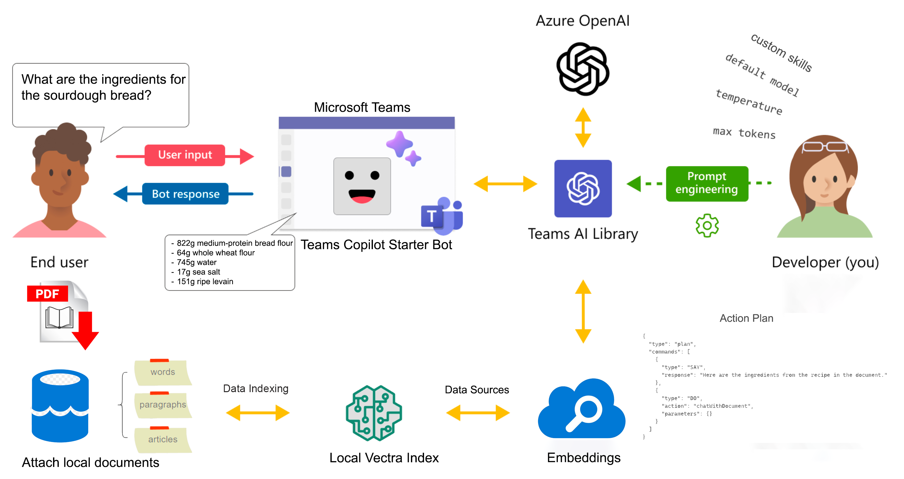

#  Teams Copilot Starter

The Teams Copilot Starter project has been developed as a starter template for solutions targeting generative AI chatbots in Microsoft Teams. Unlike traditional code samples, this starter project was developed with an eye on production deployments with uncompromised engineering fundamentals. It leverages the Teams AI Library to provide natural language conversations, formulating responses as generic text or rich Adaptive Cards. The bot included in the template is engineered to be invoked through direct conversations and a search-based message extension (that can plug into Microsoft 365 Chat).



This project is built using the TeamsFx Toolkit, which provides a simple set of functions allowing the application to be built, debugged and deployed to Azure.

## Get Started

**To get started, head over to the [Getting Started Guide](./docs/get-started.md).**

## Teams Copilot Starter Capabilities


The Teams Copilot Starter has a number of functionalities that are accessible via Teams as described below.

- Natural Language Modelling
- Prompt Engineering
- Conversation History
- Localization
- Semantic Skills
- Actions & Dynamic Prompt Functions
- Chained, Sequential and Parallel Execution of Actions
- Support for Azure Open AI, Open AI or custom AI Copilot
- External Data Sources
- Customization

### Natural Language Modelling

The Teams Copilot Starter is built to leverage OpenAI Large Language Models so you don't have to create your own. This saves you the complexity of processing natural language, and allows your users to talk to your app with their own words.

### Prompt Engineering

With a simple text file written in human language, you can describe the functionality of your Copilot skills to cue OpenAI to focus on the right user intentions and provide relevant responses.

### Conversation History

The Teams Copilot Starter can maintain the conversation history with user. The state of your user's session is not lost, allowing conversations to flow freely and arrive quickly at right outcome.

### Localization

Because OpenAI's models are trained on the open internet, they're tuned to any language, saving you the cost of localization.

### Semantic Skills

Today's AI models can easily generate messages and images for users. While this is helpful when building a simple chat app, it is not enough to build fully automated AI agents that can automate business processes and empower users to achieve more. To do so, you would need a framework that can take the responses from these models and use them to call existing code to actually do something productive.
With Semantic Skills, we've done just that. Teams Copilot Starter allows you to easily describe your existing code to AI models so they can request that they be called. Afterwards, Teams Copilot Starter skill actions do the heavy lifting of translating the model's response into a call to your code.

To see how this works, head over to the [Skills Customization Guide](./docs/concepts/skill-customization.md).

### Actions & Dynamic Prompt Functions

Leveraging provided prompts, Teams Copilot Starter creates a predictive action plan that detects user intents and map them to relevant app actions, where you can focus your business logic. These actions are even possible to chain together to make building complex workflows easy.
Sometimes, before executing a particular action, you want to call an external function to embed the result in your prompt text. To accomplish this, we've made it possible via dynamic prompt functions by using the `{{ functionName }}` syntax. For more information on dynamic prompt functions and how they can be used within the prompt templates, see [Dynamic Prompts](./docs/concepts/dynamic-prompt.md) and for more information on Action Planner, see [Action Planner](./docs/concepts/action-planner.md) guide.

### Support for Azure Open AI, Open AI or custom AI Copilot

The Teams Copilot Starter is made to support various AI systems for moderating input and output, generating plans, and executing them. The following AI systems are currently supported are:

- Azure Open AI
- Open AI
- Custom Copilot AI

### External Data Sources

External data sources allow the injection of relevant information from external sources into prompts, such as vector databases or cognitive search. A vector data source makes it easy to add [RAG](https://en.wikipedia.org/wiki/Prompt_engineering#Retrieval-augmented_generation) to any prompt, allowing for better and more accurate replies from the bot. Teams Copilot Starter comes with a built-in local vector database for Node.js, called Vectra. Using Vectra you can chat with either a website content (must be publicly accessible) or locally uploaded documents in either text (TXT) or PDF format. For each data source, a max number of tokens to use can be specified via `maxTokens` variable. For more information see [Vectra](./docs/concepts/vectra.md) guide.

## Customization

See [Skill Customization Guide](./docs/concepts/skill-customization.md) and [Action Customization Guide](./docs/concepts/action-customization.md) to explore all the ways to customize this starter project based on specific requirements such as adding new semantic skills and actions, external data sources, adaptive cards, and more.

## Run it Locally

### Prerequisites

 To run the bot in your local dev machine, you will need:

- [Node.js](https://nodejs.org/), supported versions: 16, 18. The verified Node version that this project supports is 18.19.0
- A [Microsoft 365 account for development](https://docs.microsoft.com/microsoftteams/platform/toolkit/accounts) for Microsoft Teams. This account need to be enabled to manually side load Teams App into your Teams Tenant.
- Visual Studio Code.
- [Teams Toolkit Visual Studio Code Extension](https://aka.ms/teams-toolkit) version 5.0.0 and higher or [TeamsFx CLI](https://aka.ms/teamsfx-cli)
- An [Azure subscription](https://azure.microsoft.com/) to host the required Azure resources.
- An Azure OpenAI Service with the following model deployments (refer to the [Azure OpenAI Service documentation](https://learn.microsoft.com/en-us/azure/ai-services/openai/concepts/models#standard-deployment-model-availability) for model availability by region):
  - The Azure OpenAI Service has a model deployed with deployment name `gpt-4` and model name `gpt-4`
  - The Azure OpenAI Service has a model deployed with deployment name `text-embedding` and model name `text-embedding-ada-002`
- A storage account in your Azure Subscription

## Setting up the sample

1. Clone the repository

    ```bash
    git clone https://github.com/microsoft/teams-copilot-starter.git
    ```

1. Duplicate the `.env.dev` in the `env/` folder. Rename the file to `.env.local`.

1. Set `TEAMSFX_ENV` to `local` and set `VECTRA_INDEX_PATH` to `../index` in the `.env.local` file.

1. Fill the `OPENAI_KEY`, `OPENAI_ENDPOINT`, `OPENAI_MODEL`, `OPENAI_API_VERSION`, `OPENAI_EMBEDDING_MODEL`, `STORAGE_ACCOUNT_NAME`, and `STORAGE_ACCOUNT_KEY` variables appropriately.

*NOTE*: If you want your prompt template to use a different model other than the default (configured in the `OPENAI_MODEL` environment variable), you can set the model inside the `completion` object that is defined in the `config.json` file in the `prompts` folder.

## Environment Variables

When you run the sample using the default TeamsFx launch configurations (i.e. 'Debug (Edge)') locally, TeamsFx will run the `teamsapp.local.yml` pipeline. This pipeline and the TeamsFx debug tasks (`.vscode/tasks.json`) will save new environment variables to the `.env.local` file for subsequent runs. At the bottom of the `teamsapp.local.yml` file, you will see the following:

```bash
# Generate runtime environment variables for bot
# Custom Settings
  - uses: file/createOrUpdateEnvironmentFile
    with:
      target: ./src/.localConfigs
      envs:
        # Required custom environment variables
        OPENAI_KEY: ${{OPENAI_KEY}}
        OPENAI_ENDPOINT: ${{OPENAI_ENDPOINT}}
        ....
```

This action in the pipeline copies the environment variables from the `.env.local` file to the `src/.localConfigs` file. The bot will use this `.localConfigs` file for loading the environment variables when running locally. The npm script `dev:teamsfx` that is executed injects the `.localConfigs` file as environment variables before running the application.

| Name | Description |
| --- | --- |
| `APP_NAME` | The name of the application |
| `APP_VERSION` | The version of the application |
| `BOT_APP_TYPE` | The Bot Application type. Accepted Values: 'UserAssignedMsi', 'SingleTenant', 'MultiTenant' |
| `OPENAI_KEY` | The key for the OpenAI service |
| `OPENAI_ENDPOINT` | The endpoint for the OpenAI service |
| `OPENAI_MODEL`<sup>1</sup> | The model to be used for completions. For Azure OpenAI this is the name of the deployment to use. |
| `OPENAI_EMBEDDING_MODEL` | The model to be used for embeddings. For Azure OpenAI this is the name of the deployment to use. This setting is only used when you chat with a document or web content. |
| `STORAGE_ACCOUNT_NAME` | The name of the storage account |
| `STORAGE_ACCOUNT_KEY` | The key for the storage account |
| `VECTRA_INDEX_PATH` | The path of the Vectra database index. This is used for non-production scenarios. When running locally, the value is `../index` and when running in Azure, the value is `D:\\Home\\index`. |
| `OPENAI_API_VERSION` | This is only used by Azure OpenAI |
| `DEFAULT_PROMPT_NAME` | The default prompt name. The default is `plan` and refers to the folder name in `prompts/` folder |
| `STORAGE_CONTAINER_NAME` | The name of the storage container that will store conversation state |
| `WEBDATA_SOURCE_NAME` | The name of the web data source. If this value is changed, it will also need to be changed in the `prompts/questionWeb/config.json` file |
| `DOCUMENTDATA_SOURCE_NAME` | The name of the document data source. If this value is changed, it will also need to be changed in the `prompts/questionDocument/config.json` file |
| `MAX_TURNS` | The maximum number of turns |
| `MAX_FILE_SIZE` | The maximum file size |
| `MAX_PAGES` | The maximum number of pages |
| `APPLICATIONINSIGHTS_INSTRUMENTATION_KEY` | The key for application insights. This is currently not used in local development, but can be enabled by adding it to the .env.local file and uncommenting the corresponding line in the `teamsapp.local.yml` file |
| `CUSTOM_API_CLIENT_ID` | The client ID used when using a custom OpenAI API. This is currently not used in local development, but can be enabled by adding it to the .env.local file and uncommenting the corresponding line in the `teamsapp.local.yml` file. |
| `CUSTOM_API_CLIENT_SECRET` | The client secret used when using a custom OpenAI API. This is currently not used in local development, but can be enabled by adding it to the .env.local file and uncommenting the corresponding line in the `teamsapp.local.yml` file. |

## Testing the sample

The easiest and fastest way to get up and running is with Teams Toolkit as your development guide. To use Teams Toolkit to automate setup and debugging, please [continue below](#using-teams-toolkit-for-visual-studio-code).

1. Press F5 to start debugging which launches your app in Teams using a web browser. Select `Debug (Edge)` or `Debug (Chrome)`. This action will:

    - Create app registrations in Azure for the Application and Bot
    - Register the bot in <https://dev.botframework.com/> using the account you use for M365
    - Build and run the application
    - Package the Teams App and side loads it in your M365 Tenant

1. When all actions are successful, Teams launches in the browser with the install page of your App.
1. Select the Add button in the dialog to install the app to Teams.
1. If this is the first time you added your App to Teams, you'll be created by the Welcome Adaptive Card prompting you to either choose the pre-defined Action by clicking the button or start conversation with typing in the Chat text input box.

Otherwise, if you only want to run the bot locally and build manually, please refer to the [BotFramework Emulator](https://github.com/microsoft/BotFramework-Emulator) documentation.

### Using Teams Toolkit for Visual Studio Code

The simplest way to run this sample in Teams is to use Teams Toolkit for Visual Studio Code.

1. Ensure you have downloaded and installed [Visual Studio Code](https://code.visualstudio.com/docs/setup/setup-overview)
1. Install the [Teams Toolkit extension](https://marketplace.visualstudio.com/items?itemName=TeamsDevApp.ms-teams-vscode-extension)
1. Select **File > Open Folder** in VS Code and choose this sample's directory from the repo
1. Using the extension, sign in with your Microsoft 365 account where you have permissions to upload custom apps
1. Ensure that you have set up the sample from the previous step.
1. Select **Debug > Start Debugging** or **F5** to run the app in a Teams web client.
1. In the browser that launches, select the **Add** button to install the app to Teams.

> If you do not have permission to upload custom apps (sideloading), Teams Toolkit will recommend creating and using a Microsoft 365 Developer Program account - a free program to get your own dev environment sandbox that includes Teams.

### Prompts to use in the Application

There following prompts can be used:

- `Hi`
The App will response with a welcome message.
- `Tell me about Microsoft`
The app will give a description of Microsoft
- `Give me details about Microsoft`  
The app will give a detail financial description of Microsoft.
    >Be aware that the data shown is fake and made up by OpenAI.
- `Find founders https://en.wikipedia.org/wiki/Microsoft`
This will read and index the webpage and give back an adaptive card with answer
- `Summarize document` and upload a Text or PDF document.
The bot will read and index the uploaded document and give back and adaptive card with the answer.

## Deploy to Azure

You can trigger the provision command in Teams Toolkit or TeamsFx CLI to create or update resources for the Teams Copilot Starter. The steps of the provision command are defined in the `teamsapp.yml` file, under `provision` property. You can find more information in the [deployment instructions document.](./docs/deploy-to-azure.md)

## Contributing

This project welcomes contributions and suggestions.  Most contributions require you to agree to a
Contributor License Agreement (CLA) declaring that you have the right to, and actually do, grant us
the rights to use your contribution. For details, visit <https://cla.opensource.microsoft.com>.

When you submit a pull request, a CLA bot will automatically determine whether you need to provide
a CLA and decorate the PR appropriately (e.g., status check, comment). Simply follow the instructions
provided by the bot. You will only need to do this once across all repos using our CLA.

This project has adopted the [Microsoft Open Source Code of Conduct](https://opensource.microsoft.com/codeofconduct/).
For more information see the [Code of Conduct FAQ](https://opensource.microsoft.com/codeofconduct/faq/) or
contact [opencode@microsoft.com](mailto:opencode@microsoft.com) with any additional questions or comments.

## Trademarks

This project may contain trademarks or logos for projects, products, or services. Authorized use of Microsoft
trademarks or logos is subject to and must follow
[Microsoft's Trademark & Brand Guidelines](https://www.microsoft.com/en-us/legal/intellectualproperty/trademarks/usage/general).
Use of Microsoft trademarks or logos in modified versions of this project must not cause confusion or imply Microsoft sponsorship.
Any use of third-party trademarks or logos are subject to those third-party's policies.

## Known Issues

You may encounter the following known issues documented and assigned for the futher investigation in the repo's Issues section:

### Issue [#1](https://github.com/microsoft/teams-copilot-starter/issues/1): The Bot's LLM takes only the first document content embeddings from the Vectra data sources when multiple documents are uploaded

If I try to chat with more than one document in the sequence, you won't get the correct respond from the bot starting from the second uploaded document until you reset the system by prompting `/reset` or ask Bot to forget the previously uploaded documents: `forget documents` or `/forget` using the short command.

This issue will be addressed in the upcoming updates and the status of this issue fix will be posted in the Issues section of the repo.

### Issue [#2](https://github.com/microsoft/teams-copilot-starter/issues/2): When multiple users try to chat with their own documents, the Local Vectra Index will contain the documents from all users

If you try to chat with a specific document when running in Azure environment, there are chances that your document will be shared with another user(s).

This issue will be addressed in the upcoming updates and the status of this issue fix will be posted in the Issues section of the repo.

### Issue [#3](https://github.com/microsoft/teams-copilot-starter/issues/3) When more than one document is uploaded, bot returns the same response the same number of times as loaded documents

If you load two or more documents, the bot will give the same result the same number of loaded documents.

This issue will be addressed in the upcoming updates and the status of this issue fix will be posted in the Issues section of the repo.

___________________________________

><sup>1</sup> When chosing the value for the `OPENAI_MODEL` environment variable, make sure the Azure Open AI Model Deployment name with the same name exist in your Azure Open AI account. For OpenAI, the name must match one of the existing models, as per [OpenAI documentation](https://platform.openai.com/docs/models).
