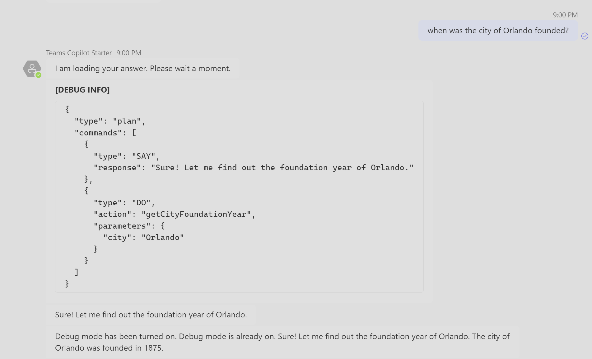
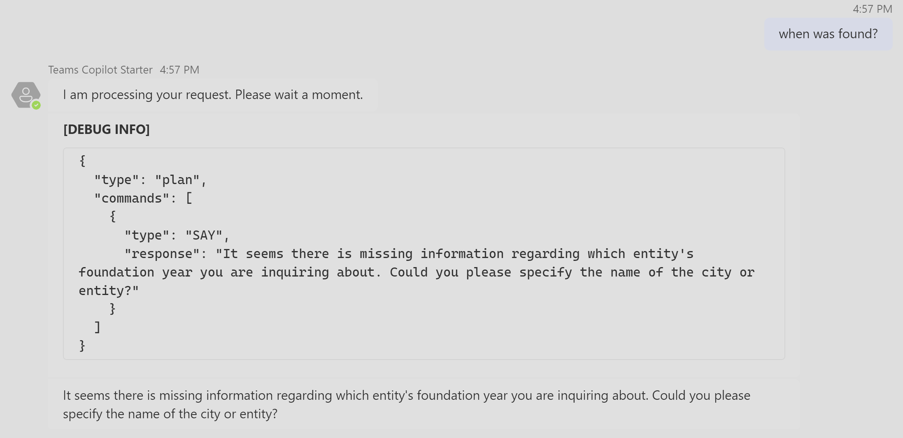

# Customizing Teams Copilot Starter: Actions

In the Teams Copilot Starter project, actions serve as atomic functions registered to the AI System. These actions are fundamental building blocks of conversational bots and are responsible for performing specific tasks such as analyzing uploaded documents, retrieving the requested information from the backend LLM, or sending messages to users. Developers can register custom actions or override default actions to meet their specific business requirements.

Custom actions allow developers to extend the functionality of the Teams Copilot Starter project to meet specific business requirements. By defining, implementing, and registering custom actions, developers can enhance the conversational capabilities of their bots and provide tailored experiences to users.

## Default Actions

Default actions are predefined actions present within the system. They handle various scenarios such as handling unknown actions, flagged input or output, HTTP errors, and more. Here's a list of default actions available in the system:

| Action                | Called when                                                                                                                   |
| --------------------- | ----------------------------------------------------------------------------------------------------------------------------- |
| `___UnknownAction___` | An unknown action is predicted by the planner.                                                                               |
| `___FlaggedInput___`  | The input is flagged by the moderator.                                                                                      |
| `___FlaggedOutput___` | The output is flagged by the moderator.                                                                                     |
| `___HttpError___`     | The planner encounters an HTTP response with a status code >= `400`.                                                          |
| `__TooManySteps__`    | The planner task either executed too many steps or timed out.                                                                |
| `___PlanReady___`     | The plan has been predicted by the planner and passed moderation. This can be overridden to mutate the plan before execution. |
| `___DO___`            | The AI system is executing a plan with the DO command.                                                                      |
| `___SAY___`           | The AI system is executing a plan with the SAY command.                                                                     |

>Note: `___DO___` and `___SAY___` are specialized actions, despite being called commands. They represent the execution of a plan's sequence.

## Custom Actions

To add a custom action, follow these steps:

### 1. Define the Action

- Define the action in the `actions.json` file located in the /prompts/plan prompt template folder.
- Each action definition includes a name, description, and optional parameters.
- Add the action name and description, ensuring clarity and accuracy.
- Optionally, add the required parameters.

```json
{
  "name": "getCityFoundationYear",
  "description": "Retrieves the foundation year of the given city",
  "parameters": {
    "type": "object",
    "properties": {
      "city": {
        "type": "string",
        "description": "The name of the city for which the foundation year is being retrieved"
      }
    },
    "required": ["city"]
  }
}
```

### 2. Implement Action Logic

- Create a new TypeScript file in the `actions` folder.
- Implement the action logic within a function matching the action name.
- Use existing skills or modules to perform necessary tasks.

```typescript
import { TurnContext } from "botbuilder";
import { ApplicationTurnState } from "../models/aiTypes";
import { ActionPlanner } from "@microsoft/teams-ai";
import { ChatGPTSkill } from "../skills";

export async function getCityFoundationYear(
  context: TurnContext,
  state: ApplicationTurnState,
  parameters: any, // Replace `any` with defined interface if needed
  planner: ActionPlanner<ApplicationTurnState>
): Promise<string> {
  // Get the city parameter from the user's input
  const city = parameters.city;

  // Call ChatGPTSkill to fetch the foundation year
  const chatGPTSkill = new ChatGPTSkill(context, state, planner);
  const response = await chatGPTSkill.run(`What is the foundation year of ${city}?`);

  // Return the response as the output of the action
  return response;
}
```

### 3. Register Action Handler

- Add the action handler to the **TeamsAI** class in `teamsAI.ts`.
- Use the `action()` method to register the action with its handler function.

```typescript
import { getCityFoundationYear } from "../actions";

// Inside the TeamsAI class constructor
this.ai.action(
  actionNames.getCityFoundationYear,
  async (context: TurnContext, state: ApplicationTurnState, parameters: any) =>
    getCityFoundationYear(context, state, parameters, this.planner)
);
```

For quick sample implementation we pass the `parameters` of type `any`. In the production environment we recommend to replace the type `any` with the predefined interface that expects the `city` parameter as it was defined in our action:

```typescript
export interface ActionParameters {
  city: string;
}
```

### 4: Test the Action

- Build the project and start the bot locally.
- Test the new action functionality by invoking it in a conversation.



If you get the same result, then your new action was successfully executed!

As additional bonus, let's see what will happen if we forget to mention the name of the city when asking about the foundation year.



As expected, the AI bot found that we forgot to mention the city name. Instead of throwing an error, the intelligent bot generated the follow up question where it asks the user to specify the missing city name.
After we entered the missing city, the AI bot will continue executing our action:


