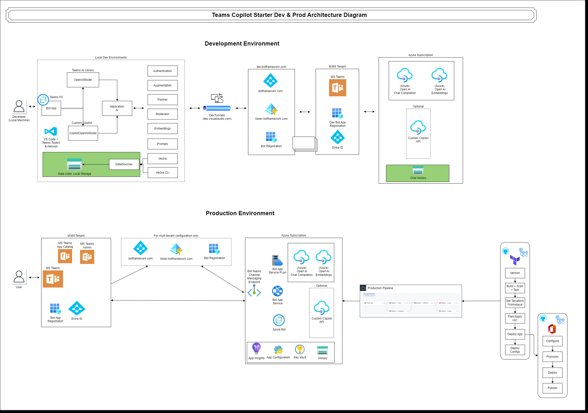

# Using Teams Toolkit for Visual Studio Code (Recommended)

## Additional Prerequisites

- [Visual Studio Code](https://code.visualstudio.com/download)
- [Teams Toolkit Visual Studio Code Extension](https://aka.ms/teams-toolkit) version 5.0.0 and higher
- [Teams Toolkit CLI v3](https://learn.microsoft.com/en-us/microsoftteams/platform/toolkit/teams-toolkit-cli?pivots=version-three)

## Setting up the Teams Copilot Starter Project

1. Prepare the Environment

    Teams Copilot Starter app requires Azure OpenAI service. Before deploying to Azure, configure Azure OpenAI related variables in your `.env` file. [Create your Azure OpenAI resource on azure portal](https://learn.microsoft.com/en-us/azure/ai-services/openai/how-to/create-resource?pivots=web-portal) and deploy [completion and embedding models](https://platform.openai.com/docs/models) on that Azure OpenAI resource.

    ```bash
    OPENAI_KEY=<OpenAI Key>
    OPENAI_ENDPOINT=<OpenAI Endpoint>
    OPENAI_MODEL=<completetion model>
    OPENAI_EMBEDDING_MODEL=<embedding model>
    ```

1. Open Teams Toolkit in Visual Studio Code, and sign in your Azure account by clicking the `Sign in to Azure` in the `ACCOUNTS` section from sidebar.

1. After you signed in, select a subscription under your account. The Teams Toolkit will use this subscription to provision Azure resources to host you app.

1. Run the `teamsapp provision` command to trigger the provision stage.

    ```bash
    teamsapp provision --env dev
    ```

> Note: Provision Azure cloud resources and deploy to Azure may cause charges to your Azure Subscription.

After the Teams Copilot Starter has been deployed to Azure, the development/test and production environment architecture may look like in the following diagram:
    

- In the development environment, the user accesses Teams Copilot Starter application, which is registered under the M365 Tenant. The copilot bot is registered to `dev.botframework.com` and `token.botframework.com` for authentication tokens. Azure blobStorage is used for storing chat history. Azure OpenAI chat completion and Azure OpenAI Embeddings are used for generation of prompts and semantic search to query a knowledge base for relevant documents.
- In the Production Environment, the user accesses Teams Copilot Starter application, which is registered under the M365 Tenant. The Bot is configured with a token obtained from token.botframework.com for authentication. Within the Azure Subscription `AzureOpenAI`, `App Insights`, and `Azure blob storage` are used for OpenAI API calls, monitoring and storing chat history.

3. Run the `teamsapp deploy` command to trigger deploy stage.

    ```bash
    teamsapp deploy --env dev
    ```

4. Run the `teamsapp publish` command to trigger publish stage.

    ```bash
    teamsapp publish --env dev
    ```

Once Teams Copilot Starter app has been published, the app becomes accessible within [Microsoft Teams admin center](https://admin.teams.microsoft.com/) under `Teams app` -> `Manage app`. From here, Teams administrators can [review and approve](https://learn.microsoft.com/en-us/microsoftteams/platform/toolkit/publish#approve-on-admin-center) the app for enterprise users.
