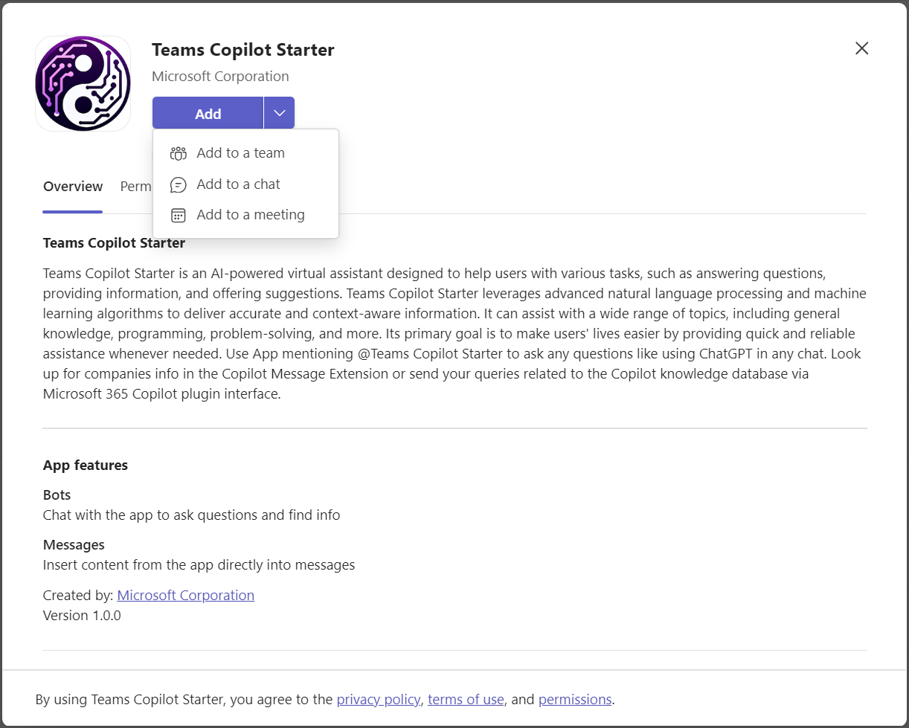
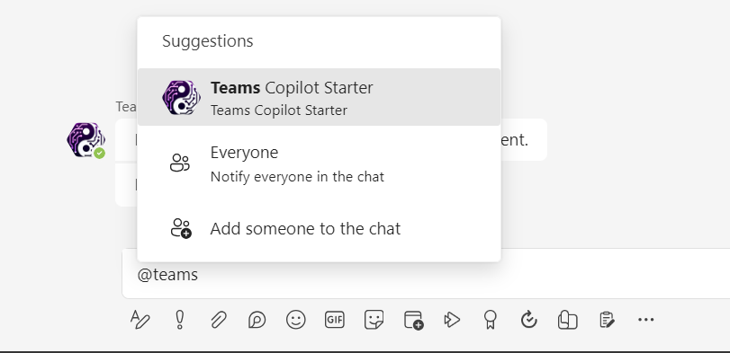
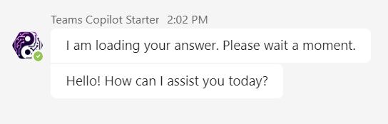
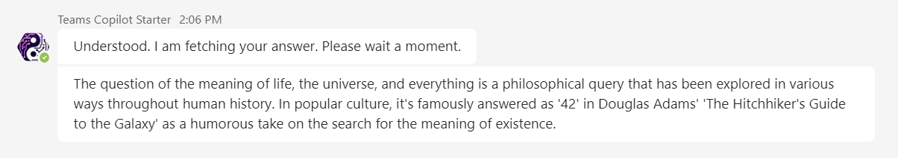
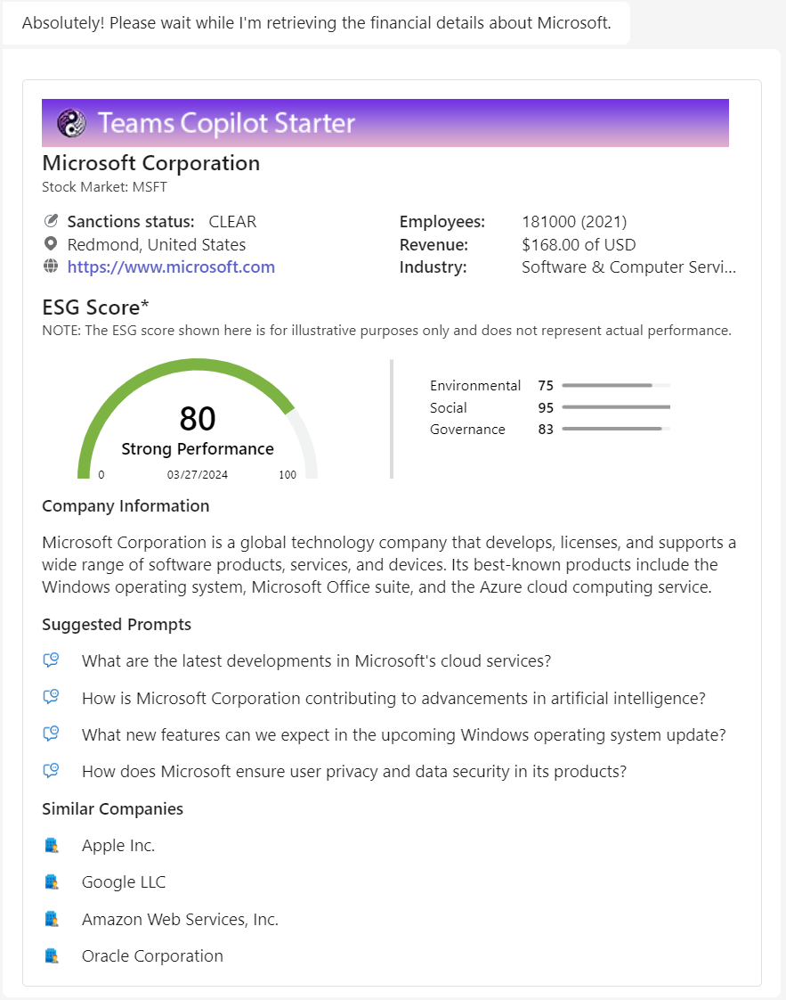
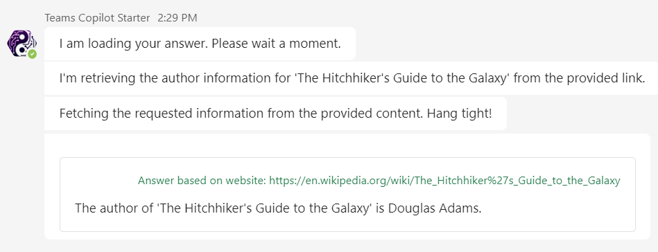
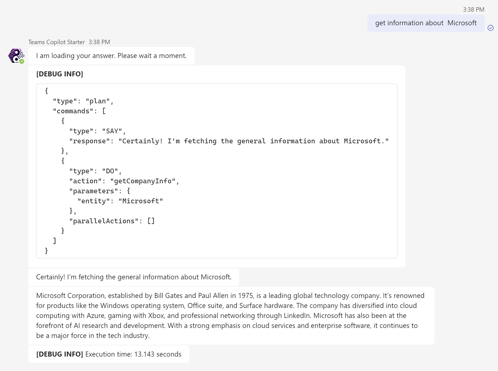

# Get Started with Teams Copilot Starter

## Use Teams Copilot Starter in personal chat or in a group chat

The Teams Copilot Starter can be installed as a personal app, in a group chat or in a meeting. This can be done by installing the app and choosing where to install the App.



In a personal app the bot can be addressed immediately. In the group chat or in meeting you have to mention the bot:

```command
@Teams Copilot Starter .....
```



## How to use the Teams Copilot Starter

The Teams Copilot Starter (TCS) is a sophisticated chatbot designed to interpret and respond to user prompts in a natural, conversational manner. Unlike many traditional chatbots, TCS does not rely on a rigid set of predefined keywords or commands to trigger specific actions. Instead, it employs advanced language understanding capabilities to discern the user's intent from their input, regardless of how it's phrased.

This means that you can interact with TCS just as you would with a human - by expressing your needs or questions freely and in your own words. There's no need to remember specific commands or conform to a particular syntax. TCS is designed to understand and respond appropriately to a wide range of prompts.

The examples below provided in this guide are merely illustrative, demonstrating some of the types of prompts that TCS can respond to. They are by no means exhaustive or restrictive. Feel free to experiment with different phrasings and types of requests - TCS is designed to handle a broad spectrum of conversational inputs.

### Welcome the bot

You can use any message to welcome the bot. The will invoke not invoke any action, but TeamsAI will use the response from OpenAI.

- Syntax: `[welcome message]`
- Example: `hello`
- Response:  


### General questions

You can ask the bot any general questions. The will invoke not invoke any action, but TeamsAI will use the response from OpenAI.

- Syntax: `[general question]`
- Example: `what is the meaning of life, universe and everything`
- Response:  


### Get Company Information

You can get general information of companies. This will invoke the *getSemanticInfo* action.

- Syntax: `Tell me about [company name]`
- Example: `Tell me about Microsoft`
- Response:  


### Get Detailed Company Information

You can get detailed company information. This will invoke the *getCompanyDetails* action and return an adaptive card with details about the company you mention.

- Syntax: `Give me details about [company name]`
- Example: `Give me details about Microsoft`
- Response:  


### Question a web page

You can question the content of a web page. The will invoke the *webRetrieval* action. The webpage is indexed. The answer is searched and an adaptive card with the answer is returned.

- Syntax: `[question] [url]`
- Example: `who is author of the book https://en.wikipedia.org/wiki/The_Hitchhiker%27s_Guide_to_the_Galaxy`
- Response:  


### Question an uploaded pdf or txt document

You can question an uploaded PDF or TXT document. This will invoke the *chatwithdocument* action. The document is indexed. The answer is search and an adaptive card with the answer is returned.

- Syntax: `[question] [uploaded document]
- Example: `Extract data from this document and then calculate the total amount of the invoice`; attach the document to upload (example [document](./../assets/sample%20documents/Invoice_1.pdf))

- Response:  


### Forget uploaded document

Uploaded document are remembered, so you can ask a question on document that are uploaded before. You can forget the documents, this is trigger the *forgetDocuments* action.

- Syntax: `[command to forget document]
- Example: `forget documents`
- Response: `I have now forgotten the documents.`

### Show uploaded document

Uploaded document are remembered, so you can ask a question on document that are uploaded before. To get the current known document use the /document command

- Syntax: `/document`
- Example: `/document`
- Response: `The current uploaded document(s) are file.pdf. Use "/forget" to forget the document(s).`

### Switch debug mode on

To get the action plan that is generated you can switch debug mode on. This will trigger the *debugon* action.

- Syntax: `[switch debug on command]`
- Example: `debug on`
- Response: `Debug is on`

This will respond an adaptive card with the action on each command. Below is an example of action plan for getting company info.



### Switch debug mode off

To get the action plan that is generated you can switch debug mode on. This will trigger the *debugon* action.

- Syntax: `[switch debug off command]`
- Example: `debug off`
- Response: `Debug is off`

## Advanced combined commands

The action planner is able to create an action plan with multiple actions. If you mention mutiple tasks in one command an action plan is created with multiple actions that will be executed in parallel.

- Syntax: `[command one] and  [command two]`
- Example: `give me details about Microsoft and summarize https://en.wikipedia.org/wiki/Earth`
- Result: This will create the following action plan:

```json
{
  "type": "plan",
  "commands": [
    {
      "type": "DO",
      "action": "getCompanyDetails",
      "parameters": {
        "entity": "Microsoft"
      },
      "parallelActions": []
    },
    {
      "type": "SAY",
      "response": "I have retrieved details about Microsoft and summarized the information on Earth from Wikipedia."
    },
    {
      "type": "DO",
      "action": "webRetrieval",
      "parameters": {
        "entity": "https://en.wikipedia.org/wiki/Earth"
      }
    }
  ]
}
```
